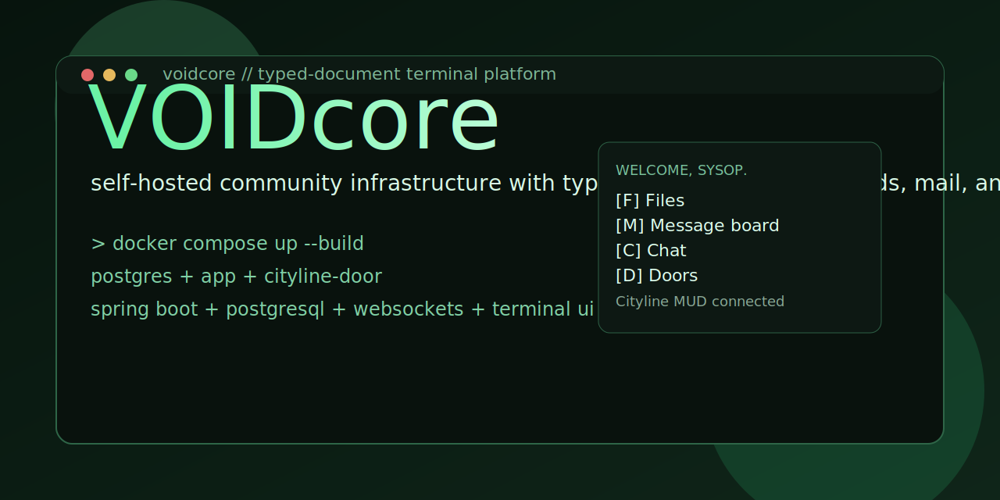

# VOIDcore

[](https://github.com/myrddian/VoidCore/actions/workflows/ci.yml)

> *Signal over noise. Structure over spectacle.*



VOIDcore is a self-hosted typed-document community platform with terminal
aesthetics and BBS-flavoured social primitives. It is for communities that
want their knowledge to be durable, queryable, and theirs — instead of
losing it inside chat silos and SaaS dashboards.

The substrate is opinionated and small: typed Markdown documents validated
against operator-definable schemas, with first-class conversation primitives
(chat, threads, mail, mentions) that stay in their own lane.

## Project status

- public split is live as a standalone repo
- Docker Compose stack boots with `postgres`, `app`, and `cityline-door`
- the user-facing surface has started the move from "releases" toward the
  more generic "files" model
- the project is usable now, but still in active extraction and polish

## What you get

- **Typed Markdown documents** with schema-driven frontmatter and revisions
- **Message boards, chat, mail (VoidMail), and mentions** as separate
  first-class primitives
- **Doors** — sidecar processes that hang off the BBS; the bundled
  Cityline MUD is the worked example
- **Terminal-native UI in the browser** — no separate client to install,
  no Electron, no mobile app

## Quick start

```sh
git clone <repo-url> voidcore
cd voidcore
docker compose up --build
```

Then open <http://localhost:8080>.

That's it. The default stack builds the app from source, starts Postgres,
applies all migrations, boots VOIDcore on `127.0.0.1:8080`, and starts the
bundled Cityline MUD door on `127.0.0.1:8081`.

The first user to register is just a regular member. To bootstrap a sysop
account on first boot, set `SYSOP_HANDLE` and `SYSOP_INITIAL_PASSWORD` in
`.env` before `docker compose up` — see [.env.example](.env.example).

## Configuration

All env vars are optional and have working repo defaults. Copy
`.env.example` to `.env` only if you want to override ports, DB
credentials, the sysop bootstrap, or Flyway overlay locations.

```sh
cp .env.example .env
make secrets >> .env   # generate strong DB and sysop passwords
```

Useful Make targets: `make up`, `make down`, `make logs`, `make psql`,
`make secrets`, `make env-check`. Run `make help` for the full list.

## What's running

`docker compose up` brings up three services on the local loopback:

- `postgres` — Postgres 17 with VOIDcore's schema and Flyway migrations
- `app` — VOIDcore on `127.0.0.1:8080` (HTTP + WebSocket)
- `cityline-door` — example MUD door, reachable through VOIDcore's door
  framework on `127.0.0.1:8081`

No backup sidecars, deployment automation, or instance-specific ops
tooling are carried in this public-engine repo — those belong in your
own deployment overlay.

## Documentation

- [SPEC.md](docs/SPEC.md) — wire protocol and screen contracts
- [SPEC-documents.md](docs/SPEC-documents.md) — typed-document model
- [SPEC-screens.md](docs/SPEC-screens.md) — screen architecture
- [SPEC-screen-navigation.md](docs/SPEC-screen-navigation.md) — navigation model
- [SPEC-doors.md](docs/SPEC-doors.md) — door protocol
- [SPEC-layout.md](docs/SPEC-layout.md) — layout primitives
- [docs/extending-voidcore.md](docs/extending-voidcore.md) — extension hooks
- [DECISIONS.md](docs/DECISIONS.md) — architectural rationale (ADRs)
- [ROADMAP.md](docs/ROADMAP.md) — direction

End-user and sysop guides are planned but not yet written.

## Community

- [CONTRIBUTING.md](CONTRIBUTING.md)
- [CODE_OF_CONDUCT.md](CODE_OF_CONDUCT.md)
- [SECURITY.md](SECURITY.md)
- [v0.1.0 release draft](docs/releases/v0.1.0.md)

## License

VOIDcore is licensed under **GPL-3.0-or-later**. See
[LICENSE](/Users/enzoreyes/proj/VoidCore/LICENSE).
